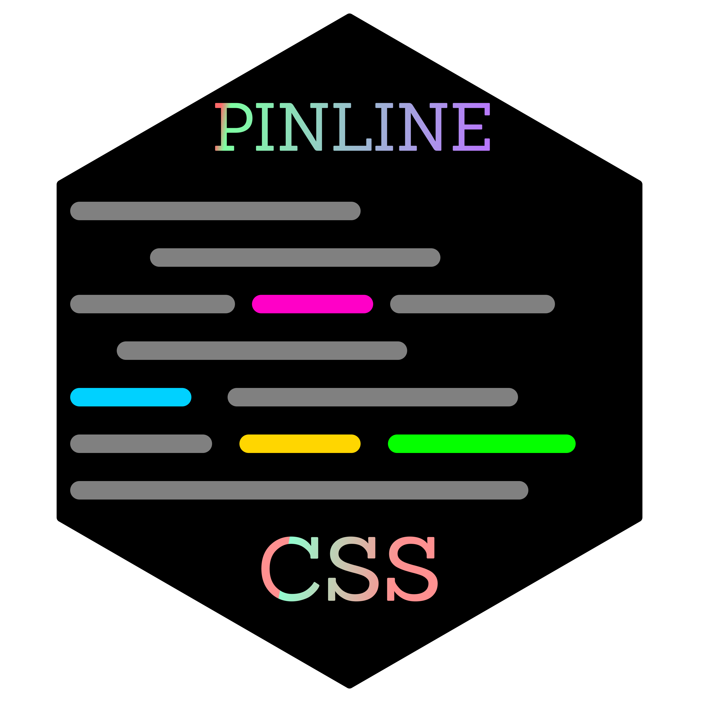
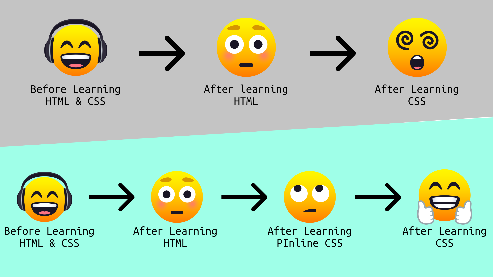

<div align="center">


<p style="font-size: 40px;">PInline CSS</p>
<p>A Library that helps in smoothening the learning curve from HTML to CSS</p>
<hr>
</div>

<br>

**Programming** is **complex/strange** and not everyone can understand it. So, in order to make sure that *beginners don't give up in the beginning*, we are introducing certain **tools** that will help in *smoothening the learning curve while shifting from HTML to CSS*.

Throught **PInline CSS**, you can *write CSS within HTML Attributes* without looking for an entirely new syntax.

PInline CSS also takes care of browser compatibility which means that you pinline code will work in every browser.

<br>

> Note: The attributes used to write CSS don't mess up with the built in attributes as they all start with a prefix "p-"

<br><br>


<br><br>

```javascript
// For Example

	color => text-color
	display => display-behaviour
	grid-auto-columns => grid-column-size
	flex-basis => flex-item-width
	flex-shrink => flex-shrink-ratio
	And many more...

```
<br><br>

## From where to learn?
We are preparing full documentation and a Tutorial for beginners to learn PInline CSS. Once you know PInline CSS, CSS is not a big deal.


